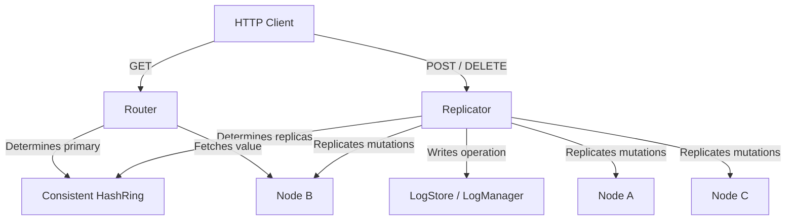

# Atlas Distributed Key-Value Store

Atlas is a lightweight, distributed, in-memory key-value store designed to demonstrate core concepts in distributed systems. It features consistent hashing, partition replication, heartbeat-based failure detection, automatic client read failovers, and offline batch log recovery.

---

## Architecture Overview

Atlas routes key-value operations dynamically through a hash ring using consistent hashing. Values are replicated to multiple backup nodes on the ring to prevent data loss in the event of node crashes.



---

## Core Features

1. **Consistent Hashing & Dynamic Ring Routing**: Distributes keys evenly across active nodes using CRC32 checksum rings.
2. **Replication Group Consensus**: Automatically replicates Set and Delete mutations to $N=3$ logical nodes in key-hash order.
3. **Heartbeat Failure Detection**: Uses background detectors to continuously verify node health. If a heartbeat expires (default timeout 5s), the node is marked DEAD and replica failover is triggered.
4. **Transparent Failover Routing**: Client GET requests are automatically rerouted to the next available healthy replica on the hash ring if the primary owner node dies.
5. **Offline Log Replay Recovery**: Restores lost nodes by replaying missing log sequences batch-wise while the node remains offline, before reviving heartbeats and placing it back into active service.

---

## Project Structure

```text
atlas/
│
├── cmd/
│   └── node/
│       └── main.go                 # Application server entry point
│
├── internal/
│   ├── api/                        # HTTP endpoints, routing, and debug controllers
│   │   ├── debug.go
│   │   ├── handlers.go
│   │   ├── node.go
│   │   └── server.go
│   │
│   ├── cluster/                    # Consistent hashing, routing, and membership
│   │   ├── failover.go
│   │   ├── failure_detector.go
│   │   ├── recovery.go
│   │   ├── replicator.go
│   │   └── ring.go
│   │
│   └── storage/                    # Low-level memory mapping & operation logging
│       ├── node.go
│       └── oplog.go
│
├── postman.json                    # Exported Postman collection for manual verification
├── README.md                       # This document
└── go.mod                          # Go module configuration
```

---

## Getting Started

### Prerequisites
- Go 1.22+ installed on your system.
- Postman (optional, for manual verification).

### Run the Server
Start the local cluster consisting of `node-A`, `node-B`, and `node-C` listening on port `8080`:
```bash
go run cmd/node/main.go
```

**Output:**
```text
[main] Added node node-A
[main] Added node node-B
[main] Added node node-C
[main] Atlas listening on :8080
```

---

## Example API Usage

Below is a summary of the HTTP API endpoints. You can also import the pre-configured Postman Collection file `postman.json` at the root of the project to test these routes.

### 1. Check Cluster Status
```bash
curl -X GET http://localhost:8080/cluster
```
**Response:**
```json
[
  { "id": "node-A", "alive": true },
  { "id": "node-B", "alive": true },
  { "id": "node-C", "alive": true }
]
```

### 2. Set a Cache Key
```bash
curl -X POST http://localhost:8080/cache \
  -H "Content-Type: application/json" \
  -d '{"key": "user_99", "value": "active_session"}'
```
**Response:**
```json
{
  "stored_on": "node-B"
}
```

### 3. Get a Cache Key
```bash
curl -X GET http://localhost:8080/cache/user_99
```
**Response:**
```json
{
  "node": "node-B",
  "value": "active_session"
}
```

### 4. Delete a Cache Key
```bash
curl -X DELETE http://localhost:8080/cache/user_99
```
**Response:**
```json
{
  "deleted_from": "node-B"
}
```

### 5. Simulate Node Failure (Kill Node)
```bash
curl -X POST http://localhost:8080/kill/node-B
```
**Response:** `204 No Content`

*(Reads to `user_99` will now automatically failover and resolve through healthy backup nodes, such as `node-C`).*

### 6. Recover and Revive Node
```bash
curl -X POST http://localhost:8080/revive/node-B
```
**Response:**
```json
{
  "status": "revived",
  "node": "node-B"
}
```

---

## Future Roadmap (v0.2.0+)
- **Disk Persistence (Write-Ahead Logging)**: Write LogManager operations to disk in binary WAL files to persist state across node reboots.
- **Raft Consensus Integration**: Replace heartbeats and ad-hoc leader promotions with an active Raft consensus group.
- **Dynamic Topology Scaling**: Support adding/removing nodes on the fly without causing complete cache invalidations.
